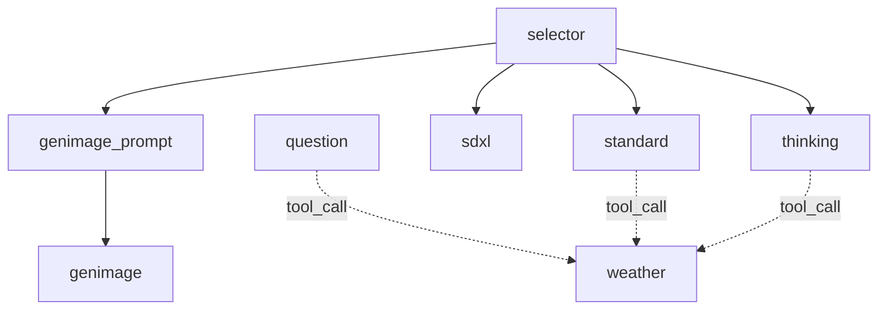

# estellm

`estellm` はAgentic Workflowを記述するためのツールです。

[](https://godoc.org/github.com/mashiike/estellm)
[](https://goreportcard.com/report/github.com/mashiike/estellm)
[](https://opensource.org/licenses/MIT)

## インストール

```sh
go get github.com/mashiike/estellm
```

## 使い方 

一番簡単なプロンプトの例は以下です。
```md
{{ define "config" }}
{
    type: "generate_text",
    description: "This is an example of chain-of-thought (COT) prompting, where the model is guided to think step-by-step to reach a conclusion.", 
    default: true,
    model_provider: "openai",
    model_id: "gpt-4o-mini",
    payload_schema: {
        type: "object",
        properties: {
            numbers: {
                type: "array",
                items: {
                    type: "integer",
                    minimum: 1,
                    maximum: 100
                },
            },
        },
        required: ["numbers"]
    },
}
{{ end }}

You are an excellent calculation agent. Please check if the user's answer is correct.
<role:user/>The sum of the odd numbers in this group will be even: 4, 8, 9, 15, 12, 2, 1.
<role:assistant/>Adding all the odd numbers (9, 15, 1) results in 25. The answer is False.
<role:user/>The sum of the odd numbers in this group will be even: 17, 10, 19, 4, 8, 12, 24.
<role:assistant/>Adding all the odd numbers (17, 19) results in 36. The answer is True.
<role:user/>The sum of the odd numbers in this group will be even: 16, 11, 14, 4, 8, 13, 24.
<role:assistant/>Adding all the odd numbers (11, 13) results in 24. The answer is True.
<role:user/>The sum of the odd numbers in this group will be even: 17, 9, 10, 12, 13, 4, 2.
<role:assistant/>Adding all the odd numbers (17, 9, 13) results in 39. The answer is False.
<role:user/>The sum of the odd numbers in this group will be even: {{ .payload.numbers | join ", " }}.
<role:assistant/>Adding all the odd numbers
```

以下のようなjsonを与えることで、このプロンプトを描画して実行することができます。

```json
{
  "numbers": [15,5,13,7,1]
}

このプロンプトを上記のペイロードで描画すると以下のようになります。

```sh
$ cat _example/simple/payload.json| go run cmd/estellm/main.go --project _example/simple render
{"time":"2025-03-11T12:19:50.234501+09:00","level":"INFO","msg":"load prompts","prompts":"_example/simple/prompts","includes":"_example/simple/includes"}


You are an excellent calculation agent. Please check if the user's answer is correct.
<role:user/>The sum of the odd numbers in this group will be even: 4, 8, 9, 15, 12, 2, 1.
<role:assistant/>Adding all the odd numbers (9, 15, 1) results in 25. The answer is False.
<role:user/>The sum of the odd numbers in this group will be even: 17, 10, 19, 4, 8, 12, 24.
<role:assistant/>Adding all the odd numbers (17, 19) results in 36. The answer is True.
<role:user/>The sum of the odd numbers in this group will be even: 16, 11, 14, 4, 8, 13, 24.
<role:assistant/>Adding all the odd numbers (11, 13) results in 24. The answer is True.
<role:user/>The sum of the odd numbers in this group will be even: 17, 9, 10, 12, 13, 4, 2.
<role:assistant/>Adding all the odd numbers (17, 9, 13) results in 39. The answer is False.
<role:user/>The sum of the odd numbers in this group will be even: 15, 5, 13, 7, 1.
<role:assistant/>Adding all the odd numbers
```

そして、以下のように実行することができます。

```sh
$ cat _example/simple/payload.json| estellm --project _example/simple exec       
{"time":"2025-03-11T12:16:35.504186+09:00","level":"INFO","msg":"load prompts","prompts":"_example/simple/prompts","includes":"_example/simple/includes"}
The odd numbers in the group are 15, 5, 13, 7, and 1. 

Calculating the sum:

15 + 5 + 13 + 7 + 1 = 41.

The sum is 41, which is odd. Therefore, the answer is False.
```

コマンドは以下のHelpとしては以下のようになります。

```sh
$ estellm --help
Usage: estellm <command> [flags]

Estellm is a tool for llm agetnts flow control.

Flags:
  -h, --help                      Show context-sensitive help.
      --log-format="json"         Log format ($LOG_FORMAT)
      --[no-]color                Enable color output
      --debug                     Enable debug mode ($DEBUG)
      --ext-var=KEY=VALUE;...     External variables external string values for Jsonnet ($EXT_VAR)
      --ext-code=KEY=VALUE;...    External code external string values for Jsonnet ($EXT_CODE)
      --project="./"              Project directory ($ESTELLM_PROJECT)
      --prompts="./prompts"       Prompts directory ($ESTELLM_PROMPTS)
      --includes="./includes"     Includes directory ($ESTELLM_INCLUDES)

Commands:
  exec [<prompt-name>] [flags]
    Execute the estellm

  render [<prompt-name> [<target>]] [flags]
    Render prompt/config the estellm

  docs [flags]
    Show agents documentation

  version [flags]
    Show version

Run "estellm <command> --help" for more information on a command.
```
## Advanced Usage

詳しくは、 [Advanced Usage](./_example/advanced/) の中のプロンプトを参照してください。
この例は以下のようなワークフローを表しています。



この図は以下で生成できます。
```sh
$estellm --project _example/advanced docs
```

### `ref` テンプレート関数
`estellm` の強力な機能の一つとして、プロンプト間での実行調整になります。
以下の２つのプロンプトをプロンプトを例にします。

_example/advanced/prompts/genimage_prompt.md
```
{{ define "config" }}
local payload_schema = import '@includes/payload_schema/question.libsonnet';
{
    type: "generate_text",
    description: "This agent is used for image generation purposes. If the question indicates the intention to generate an image, use this agent to generate the image.", 
    model_provider: "bedrock",
    model_id: "anthropic.claude-3-5-sonnet-20241022-v2:0",
    payload_schema: payload_schema,
    depends_on: ["selector"],
}
{{ end }}

Your task is to interpret the user's question and output a prompt to generate an appropriate image.
Follow the rules below for outputting the prompt.
<rule>
  * The prompt must be output in English.
  * The prompt must be within 4000 characters. There are no exceptions.
  * The prompt must include the following elements:
    * Image quality, subject information
    * If it is a person, information about clothing, hairstyle, expression, accessories, etc.
    * Information about the art style
    * Information about the background
    * Information about the composition
    * Information about lighting and filters
</rule>
Start the prompt immediately without any preamble.
<role:user/> {{ .payload.question }}
```

_example/advanced/prompts/genimage_prompt.md
```
{{ define "config" }}
{
    type: "generate_image", 
    model_provider: "openai",
    model_id: "dall-e-3",
    description: "This agent generates images using DALL-E 3."
}
{{ end }}

{{ (ref `genimage_prompt`).result }}
```

`ref`というテンプレート関数を使うことで、`estellm` はこのプロンプトの依存関係を解釈して、適切な順序でプロンプトを実行します。

```sh
$ cat _example/advanced/payload_generate_image.json| go run cmd/estellm/main.go --project _example/advanced exec genimage_prompt
{"time":"2025-03-11T14:09:48.135067+09:00","level":"INFO","msg":"load prompts","prompts":"_example/advanced/prompts","includes":"_example/advanced/includes"}
<prompt type="provided">(photorealistic, highly detailed) A vibrant red apple with smooth, glossy skin, displaying perfect ripeness, slight natural variations in color, small white speckles, (masterful photography, 8k resolution), sitting on a minimalist white surface, soft side lighting creating gentle shadows and highlights, macro photography composition with shallow depth of field, slight bokeh effect in background, natural daylight streaming from the left side, subtle reflection on the surface, ultra-sharp focus on the apple's texture, color grading emphasizing deep reds and natural tones</prompt><prompt type="revised">A photorealistic image in 8k resolution showing a vibrant red apple with glossy, ripe skin. The surface of the apple has slight natural variations in color, complemented by small white speckles. The apple is placed on a minimalist white surface, with soft side lighting creating gentle shadows and highlights. The composition takes on the style of macro photography, with a shallow depth of field and a slight bokeh effect in the background. Natural daylight is streaming from the left side, creating a subtle reflection on the surface. The focus is ultra-sharp on the apple's texture, while the color grading emphasizes the deep reds and natural tones.</prompt>

```

生成された画像は、通常では `generated` ディレクトリに保存されます。これは `--file-output` フラグを使って変更することができます。

`ref` テンプレート関数の中身は以下のようになっています。 
```jsonnet
{
  "config": {
    "dependents": 。
      "fuga"
    ],
    "description": "[this is a privious agent description]",
    "type": "constant"
    //... and more 
  },
  "result": {
    "_raw": "\n\n[This is a privious agent response]\n\n"
    // if json response, parsed key-value pairs are here
  }
}
```

`.config`　には参照元のパース後のjsonデータが入っています。 `.result`には実行結果が入っています。

### agent types 

`estellm` は複数の種類のエージェントをサポートしています。

#### `generate_text` 


一番基本的なエージェントで、LLMを用いてテキストを生成します。
```
{{ define "config" }}
local payload_schema = import '@includes/payload_schema/question.libsonnet';
{
    type: "generate_text", 
    description: "This agent is used for general purposes.",
    model_provider: "openai",
    model_id: "gpt-4o-mini",
    payload_schema: payload_schema,
    tools: [
        "weather"
    ],
}
{{ end }}

You are an AI agent that answers user questions politely. Please answer the user's question.
<role:user/> {{ .payload.question }}
```

`config` 部分では、`model_provider` と `model_id` で使用するモデルを指定します。`payload_schema` で入力データのスキーマを指定します。
また、`tools` で他のプロンプトを指定すると `Function Calling` に対応している場合はToolとして使用します。
`config` 部分は、jsonnetで記述できます。また、パスは `@includes` や `@prompts` というエイリアスを使って、それぞれ実行時のプロンプトなどのパスをimportできます。

#### `generate_image` 

画像生成エージェントでSDXLやDALL-Eなどの生成モデルを用いて画像を生成します。

```
{{ define "config" }}
{
    type: "generate_image", 
    model_provider: "bedrock",
    model_id: "stability.stable-diffusion-xl-v1",
}
{{ end }}

{
  "prompt":"1 girl,standing pose,cute,cute eyes,detailed hair,anime,highlight hair,front sun light,beautiful hair,illustration,face up,smile,white teeth, school uniform, blue ribbon,gentle smiling expression of a woman,black hair,break,Blue eyes, acing front,",
  "negative_prompt": "worst quality,ugly,bad anatomy,jpeg artifacts"
}
```

* 画像生成AIがどのようなプロンプトを必要としているかは、対象によって変わります。

#### `decision` 

意思決定エージェント。指定されたプロンプトに従い、JSONをLLMに生成させます。その後JSONを解釈して次に実行するべきエージェントを決定します。
```
{{ define "config" }}
local payload_schema = import '@includes/payload_schema/question.libsonnet';
{
    type: "decision",
    default: true, 
    model_provider: "bedrock",
    model_id: "anthropic.claude-3-haiku-20240307-v1:0",
    payload_schema: payload_schema, 
    fallback_agent: "standard",
    fallback_threashold: 0.5,
    description: "Analyze the user's question and select the appropriate agent."
}
{{ end }}

Your task is to analyze the user's question and select the appropriate agent.

The answer should be in JSON format according to the schema below.
<output_schema>
{{ decisionSchema (dependentNames) | toJson }}
</output_schema>
Please write the reasoning in English.

The available agents are as follows.
<agents>
{{- range $i, $v :=  dependentNames}}
{{- $conf := (get (dependents) $v).config }}
    <agent name="{{ $v }}"> {{ $conf.description }} </agent>
{{- end }}
</agents>

Start the answer immediately without any preamble and output only the correct JSON.
<role:user/> {{ .payload | toJson }}
```

このエージェントでは `decisionSchema` や `dependents`、`dependentNames` などの関数を使って、プロンプトを構成します。
`dependents` では、このプロンプトに依存しているものの `ref` と同じ内容が入ったsliceが返されます。
`dependentNames` は、このプロンプトに依存しているプロンプトの名前のsliceが返されます。
`decisionSchema` は、選択肢の[]stringを受け取り、それを元にこのAgentが期待するjson schemaを返します。

`decisionSchema`に従ったJSONとどのように選択するか？の方針を書くことで、LLMを使って意思決定させます。

#### `constant`

描画された内容をそのまま出力とします。ワークフローの合流系とかで使用することを想定しています。

```
{{ define "config" }}
{
    type: "constant", 
    description: "Fetches weather information.",
    payload_schema: {
        type: "object",
        properties: {
            location: { 
                type: "string",
                example: "Tokyo",
                description: "The name of the location to fetch the weather for",
            },
        },
        required: ["location"],
    },   
}
{{ end }}

{{- if eq .payload.location "Tokyo" -}}
Cloudy
{{- else -}}
Sunny
{{- end -}}
```


## 使い方 (ライブラリとして)

```go
package main

import (
	"context"
	"embed"
	"log"
	"os"

	"github.com/mashiike/estellm"
	_ "github.com/mashiike/estellm/agent/gentext"
	_ "github.com/mashiike/estellm/provider/openai"
)

//go:embed prompts
var promptsFS embed.FS

func main() {
	ctx := context.Background()
	mux, err := estellm.NewAgentMux(ctx, estellm.WithPromptsFS(promptsFS))
	if err != nil {
		log.Fatalf("new agent mux: %v", err)
	}
	payload := map[string]interface{}{
		"numbers": []int{15, 5, 13, 7, 1},
	}
	req, err := estellm.NewRequest("simple", payload)
	if err != nil {
		log.Fatalf("new request: %v", err)
	}
	w := estellm.NewTextStreamingResponseWriter(os.Stdout)
	if err := mux.Execute(ctx, req, w); err != nil {
		log.Fatalf("execute: %v", err)
	}
}
```

- `command1` - コマンド1の説明
- `command2` - コマンド2の説明ggg

## ライセンス

MIT
