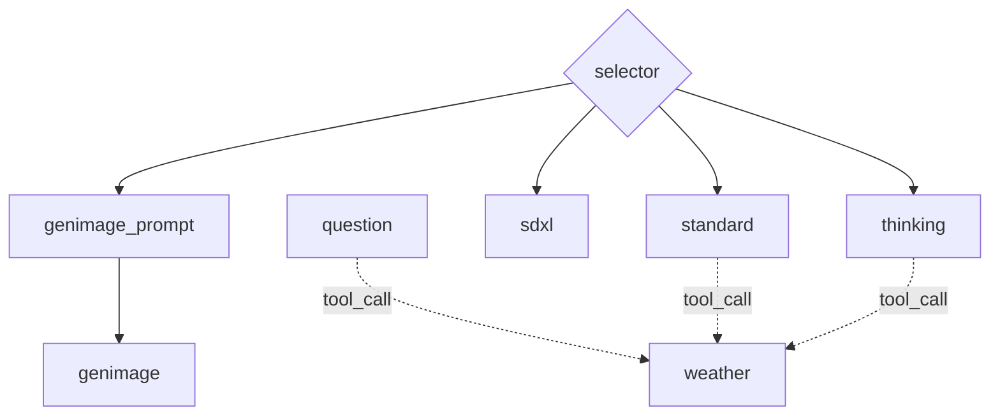

# estellm

`estellm` is a tool for describing Agentic Workflow.

[](https://godoc.org/github.com/mashiike/estellm)
[](https://goreportcard.com/report/github.com/mashiike/estellm)
[](https://opensource.org/licenses/MIT)

## Installation

```sh
go get github.com/mashiike/estellm
```

## Usage

The simplest example of a prompt is as follows.
```md
{{ define "config" }}
{
    type: "generate_text",
    description: "This is an example of chain-of-thought (COT) prompting, where the model is guided to think step-by-step to reach a conclusion.", 
    default: true,
    model_provider: "openai",
    model_id: "gpt-4o-mini",
    payload_schema: {
        type: "object",
        properties: {
            numbers: {
                type: "array",
                items: {
                    type: "integer",
                    minimum: 1,
                    maximum: 100
                },
            },
        },
        required: ["numbers"]
    },
}
{{ end }}

You are an excellent calculation agent. Please check if the user's answer is correct.
<role:user/>The sum of the odd numbers in this group will be even: 4, 8, 9, 15, 12, 2, 1.
<role:assistant/>Adding all the odd numbers (9, 15, 1) results in 25. The answer is False.
<role:user/>The sum of the odd numbers in this group will be even: 17, 10, 19, 4, 8, 12, 24.
<role:assistant/>Adding all the odd numbers (17, 19) results in 36. The answer is True.
<role:user/>The sum of the odd numbers in this group will be even: 16, 11, 14, 4, 8, 13, 24.
<role:assistant/>Adding all the odd numbers (11, 13) results in 24. The answer is True.
<role:user/>The sum of the odd numbers in this group will be even: 17, 9, 10, 12, 13, 4, 2.
<role:assistant/>Adding all the odd numbers (17, 9, 13) results in 39. The answer is False.
<role:user/>The sum of the odd numbers in this group will be even: {{ .payload.numbers | join ", " }}.
<role:assistant/>Adding all the odd numbers
```

You can render and execute this prompt by providing the following JSON.

```json
{
  "numbers": [15,5,13,7,1]
}
```
Rendering this prompt with the above payload will look like this.

```
$ cat _example/simple/payload.json| go run cmd/estellm/main.go --project _example/simple render
{"time":"2025-03-11T12:19:50.234501+09:00","level":"INFO","msg":"load prompts","prompts":"_example/simple/prompts","includes":"_example/simple/includes"}


You are an excellent calculation agent. Please check if the user's answer is correct.
<role:user/>The sum of the odd numbers in this group will be even: 4, 8, 9, 15, 12, 2, 1.
<role:assistant/>Adding all the odd numbers (9, 15, 1) results in 25. The answer is False.
<role:user/>The sum of the odd numbers in this group will be even: 17, 10, 19, 4, 8, 12, 24.
<role:assistant/>Adding all the odd numbers (17, 19) results in 36. The answer is True.
<role:user/>The sum of the odd numbers in this group will be even: 16, 11, 14, 4, 8, 13, 24.
<role:assistant/>Adding all the odd numbers (11, 13) results in 24. The answer is True.
<role:user/>The sum of the odd numbers in this group will be even: 17, 9, 10, 12, 13, 4, 2.
<role:assistant/>Adding all the odd numbers (17, 9, 13) results in 39. The answer is False.
<role:user/>The sum of the odd numbers in this group will be even: 15, 5, 13, 7, 1.
<role:assistant/>Adding all the odd numbers
```

And you can execute it as follows.

```
$ cat _example/simple/payload.json| estellm --project _example/simple exec       
{"time":"2025-03-11T12:16:35.504186+09:00","level":"INFO","msg":"load prompts","prompts":"_example/simple/prompts","includes":"_example/simple/includes"}
The odd numbers in the group are 15, 5, 13, 7, and 1. 

Calculating the sum:

15 + 5 + 13 + 7 + 1 = 41.

The sum is 41, which is odd. Therefore, the answer is False.
```

The command help is as follows.

```sh
$ estellm --help
Usage: estellm <command> [flags]

Estellm is a tool for llm agents flow control.

Flags:
  -h, --help                      Show context-sensitive help.
      --log-format="json"         Log format ($LOG_FORMAT)
      --[no-]color                Enable color output
      --debug                     Enable debug mode ($DEBUG)
      --ext-var=KEY=VALUE;...     External variables external string values for Jsonnet ($EXT_VAR)
      --ext-code=KEY=VALUE;...    External code external string values for Jsonnet ($EXT_CODE)
      --project="./"              Project directory ($ESTELLM_PROJECT)
      --prompts="./prompts"       Prompts directory ($ESTELLM_PROMPTS)
      --includes="./includes"     Includes directory ($ESTELLM_INCLUDES)

Commands:
  exec [<prompt-name>] [flags]
    Execute the estellm

  render [<prompt-name> [<target>]] [flags]
    Render prompt/config the estellm

  docs [flags]
    Show agents documentation

  version [flags]
    Show version

Run "estellm <command> --help" for more information on a command.
```
## Advanced Usage

For more details, refer to the prompts in [Advanced Usage](./_example/advanced/).
This example represents the following workflow.



You can generate this diagram with the following command.
```sh
$estellm --project _example/advanced docs
```

### `ref` Template Function
One of the powerful features of `estellm` is the ability to coordinate execution between prompts.
Let's take the following two prompts as an example.

_example/advanced/prompts/genimage_prompt.md
```
{{ define "config" }}
local payload_schema = import '@includes/payload_schema/question.libsonnet';
{
    type: "generate_text",
    description: "This agent is used for image generation purposes. If the question indicates the intention to generate an image, use this agent to generate the image.", 
    model_provider: "bedrock",
    model_id: "anthropic.claude-3-5-sonnet-20241022-v2:0",
    payload_schema: payload_schema,
    depends_on: ["selector"],
}
{{ end }}

Your task is to interpret the user's question and output a prompt to generate an appropriate image.
Follow the rules below for outputting the prompt.
<rule>
  * The prompt must be output in English.
  * The prompt must be within 4000 characters. There are no exceptions.
  * The prompt must include the following elements:
    * Image quality, subject information
    * If it is a person, information about clothing, hairstyle, expression, accessories, etc.
    * Information about the art style
    * Information about the background
    * Information about the composition
    * Information about lighting and filters
</rule>
Start the prompt immediately without any preamble.
<role:user/> {{ .payload.question }}
```

_example/advanced/prompts/genimage_prompt.md
```
{{ define "config" }}
{
    type: "generate_image", 
    model_provider: "openai",
    model_id: "dall-e-3",
    description: "This agent generates images using DALL-E 3."
}
{{ end }}

{{ (ref `genimage_prompt`).result }}
```

By using the `ref` template function, `estellm` interprets the dependencies of these prompts and executes them in the correct order.

```sh
$ cat _example/advanced/payload_generate_image.json| go run cmd/estellm/main.go --project _example/advanced exec genimage_prompt
{"time":"2025-03-11T14:09:48.135067+09:00","level":"INFO","msg":"load prompts","prompts":"_example/advanced/prompts","includes":"_example/advanced/includes"}
<prompt type="provided">(photorealistic, highly detailed) A vibrant red apple with smooth, glossy skin, displaying perfect ripeness, slight natural variations in color, small white speckles, (masterful photography, 8k resolution), sitting on a minimalist white surface, soft side lighting creating gentle shadows and highlights, macro photography composition with shallow depth of field, slight bokeh effect in background, natural daylight streaming from the left side, subtle reflection on the surface, ultra-sharp focus on the apple's texture, color grading emphasizing deep reds and natural tones</prompt><prompt type="revised">A photorealistic image in 8k resolution showing a vibrant red apple with glossy, ripe skin. The surface of the apple has slight natural variations in color, complemented by small white speckles. The apple is placed on a minimalist white surface, with soft side lighting creating gentle shadows and highlights. The composition takes on the style of macro photography, with a shallow depth of field and a slight bokeh effect in the background. Natural daylight is streaming from the left side, creating a subtle reflection on the surface. The focus is ultra-sharp on the apple's texture, while the color grading emphasizes the deep reds and natural tones.</prompt>

```

The generated image is usually saved in the `generated` directory. You can change this with the `--file-output` flag.

The contents of the `ref` template function are as follows.
```jsonnet
{
  "config": {
    "dependents": 。
      "fuga"
    ],
    "description": "[this is a privious agent description]",
    "type": "constant"
    //... and more 
  },
  "result": {
    "_raw": "\n\n[This is a privious agent response]\n\n"
    // if json response, parsed key-value pairs are here
  }
}
```

`.config` contains the parsed JSON data of the referenced prompt. `.result` contains the execution result.

### agent types 

`estellm` supports multiple types of agents.

#### `generate_text` 

The most basic agent that generates text using LLM.
```
{{ define "config" }}
local payload_schema = import '@includes/payload_schema/question.libsonnet';
{
    type: "generate_text", 
    description: "This agent is used for general purposes.",
    model_provider: "openai",
    model_id: "gpt-4o-mini",
    payload_schema: payload_schema,
    tools: [
        "weather"
    ],
}
{{ end }}

You are an AI agent that answers user questions politely. Please answer the user's question.
<role:user/> {{ .payload.question }}
```

In the `config` section, specify the model to use with `model_provider` and `model_id`. Specify the input data schema with `payload_schema`.
You can also specify other prompts as tools with `tools` if they support Function Calling.
The `config` section can be written in jsonnet. Paths can be imported using aliases like `@includes` and `@prompts`.

#### `generate_image` 

An image generation agent that generates images using models like SDXL or DALL-E.

```
{{ define "config" }}
{
    type: "generate_image", 
    model_provider: "bedrock",
    model_id: "stability.stable-diffusion-xl-v1",
}
{{ end }}

{
  "prompt":"1 girl,standing pose,cute,cute eyes,detailed hair,anime,highlight hair,front sun light,beautiful hair,illustration,face up,smile,white teeth, school uniform, blue ribbon,gentle smiling expression of a woman,black hair,break,Blue eyes, acing front,",
  "negative_prompt": "worst quality,ugly,bad anatomy,jpeg artifacts"
}
```

* The type of prompt required by the image generation AI depends on the target.

#### `decision` 

A decision-making agent. It generates JSON using LLM according to the specified prompt and then interprets the JSON to decide which agent to execute next.
```
{{ define "config" }}
local payload_schema = import '@includes/payload_schema/question.libsonnet';
{
    type: "decision",
    default: true, 
    model_provider: "bedrock",
    model_id: "anthropic.claude-3-haiku-20240307-v1:0",
    payload_schema: payload_schema, 
    fallback_agent: "standard",
    fallback_threashold: 0.5,
    description: "Analyze the user's question and select the appropriate agent."
}
{{ end }}

Your task is to analyze the user's question and select the appropriate agent.

The answer should be in JSON format according to the schema below.
<output_schema>
{{ decisionSchema (dependentNames) | toJson }}
</output_schema>
Please write the reasoning in English.

The available agents are as follows.
<agents>
{{- range $i, $v :=  dependentNames}}
{{- $conf := (get (dependents) $v).config }}
    <agent name="{{ $v }}"> {{ $conf.description }} </agent>
{{- end }}
</agents>

Start the answer immediately without any preamble and output only the correct JSON.
<role:user/> {{ .payload | toJson }}
```

This agent uses functions like `decisionSchema`, `dependents`, and `dependentNames` to construct the prompt.
`dependents` returns a slice with the same content as `ref` for those dependent on this prompt.
`dependentNames` returns a slice of the names of the prompts dependent on this prompt.
`decisionSchema` takes a []string of choices and returns the JSON schema expected by this agent.

By writing the JSON according to `decisionSchema` and the policy on how to select, you can use LLM to make decisions.

#### `constant`

Outputs the rendered content as is. It is intended to be used at workflow merge points.

```
{{ define "config" }}
{
    type: "constant", 
    description: "Fetches weather information.",
    payload_schema: {
        type: "object",
        properties: {
            location: { 
                type: "string",
                example: "Tokyo",
                description: "The name of the location to fetch the weather for",
            },
        },
        required: ["location"],
    },   
}
{{ end }}

{{- if eq .payload.location "Tokyo" -}}
Cloudy
{{- else -}}
Sunny
{{- end -}}
```


## Usage (as a library)

```go
package main

import (
	"context"
	"embed"
	"log"
	"os"

	"github.com/mashiike/estellm"
	_ "github.com/mashiike/estellm/agent/gentext"
	_ "github.com/mashiike/estellm/provider/openai"
)

//go:embed prompts
var promptsFS embed.FS

func main() {
	ctx := context.Background()
	mux, err := estellm.NewAgentMux(ctx, estellm.WithPromptsFS(promptsFS))
	if err != nil {
		log.Fatalf("new agent mux: %v", err)
	}
	payload := map[string]interface{}{
		"numbers": []int{15, 5, 13, 7, 1},
	}
	req, err := estellm.NewRequest("simple", payload)
	if err != nil {
		log.Fatalf("new request: %v", err)
	}
	w := estellm.NewTextStreamingResponseWriter(os.Stdout)
	if err := mux.Execute(ctx, req, w); err != nil {
		log.Fatalf("execute: %v", err)
	}
}
```

You can also implement `Agent` and `ModelProvider` independently.

```go
type MyAgent struct {
	estellm.Agent 
}

estellm.RegisterAgent("myagent", func(ctx context.Context, p *estellm.Prompt) (estellm.Agent, error) {
	return &MyAgent{}, nil
})
```

```go
type MyModelProvider struct {
	estellm.ModelProvider 
}

estellm.RegisterModelProvider("mymodelprovider", &MyModelProvider{})
```

## Remote Tool

`estellm` provides a feature called RemoteTool, which allows you to implement tools over HTTP.
The `estellm` package includes an implementation for using RemoteTool and providing RemoteToolHandler.
For more details, refer to [RemoteTool](./_example/remote_tool).

You can implement a server that provides a remote tool as follows:

```go
package main

import (
	"context"
	"flag"
	"fmt"
	"io"
	"log"
	"net/http"
	"net/url"

	"github.com/mashiike/estellm"
)

type getExchangeRateInput struct {
	BaseCurrency string `json:"base_currency" jsonschema:"title=base currency,description=The base currency,example=USD,default=USD"`
}

func main() {
	var port int
	flag.IntVar(&port, "port", 8088, "port number")
	flag.Parse()
	tool, err := estellm.NewTool(
		"get_exchange_rate",
		"Get current exchange rate",
		func(ctx context.Context, input getExchangeRateInput, w estellm.ResponseWriter) error {
			toolUseID, ok := estellm.ToolUseIDFromContext(ctx)
			if !ok {
				toolUseID = "<unknown>"
			}
			log.Printf("call get_exchange_rate tool: tool_use_id=%s, base_currency=%s", toolUseID, input.BaseCurrency)
			resp, err := http.Get("https://api.exchangerate-api.com/v4/latest/USD")
			if err != nil {
				return err
			}
			defer resp.Body.Close()
			bs, err := io.ReadAll(resp.Body)
			if err != nil {
				return err
			}
			w.WritePart(estellm.TextPart(string(bs)))
			w.Finish(estellm.FinishReasonEndTurn, http.StatusText(resp.StatusCode))
			return nil
		},
	)
	if err != nil {
		log.Fatal(err)
	}
	u, err := url.Parse(fmt.Sprintf("http://localhost:%d", port))
	if err != nil {
		log.Fatal(err)
	}
	handler, err := estellm.NewRemoteToolHandler(estellm.RemoteToolHandlerConfig{
		Endpoint: u,
		Tool:     tool,
	})
	if err != nil {
		log.Fatal(err)
	}
	log.Println("start server")
	if err := http.ListenAndServe(fmt.Sprintf(":%d", port), handler); err != nil {
		log.Fatal(err)
	}
}
```

This tool fetches and returns the current exchange rate.
`estellm.NewTool` is a generic function that uses [github.com/invopop/jsonschema](https://github.com/invopop/jsonschema) to generate the JSON schema for the input from the struct.

You can use this tool by specifying the endpoint in the tools section of each prompt.

```md
{{ define "config" }}
local env = std.native('env');
{
    //...
    tools: [
        env("REMOTE_TOOL_URL", "http://localhost:8088"),
    ],
}
{{ end }}
// ...
```

## License

MIT
