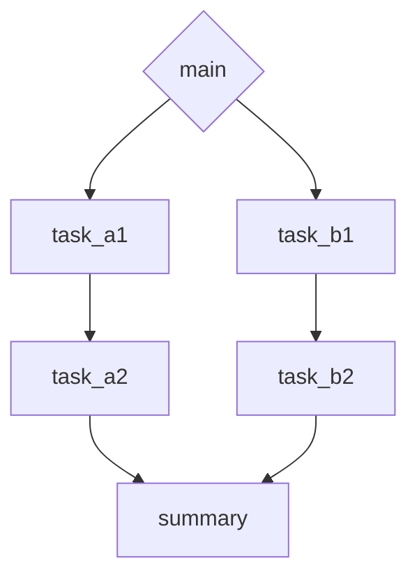

```mermaid
flowchart TD
    A0{main}
    A1[summary]
    A2[task_a1]
    A3[task_a2]
    A4[task_b1]
    A5[task_b2]
    A0 --> A2
    A0 --> A4
    A2 --> A3
    A3 --> A1
    A4 --> A5
    A5 --> A1
```
