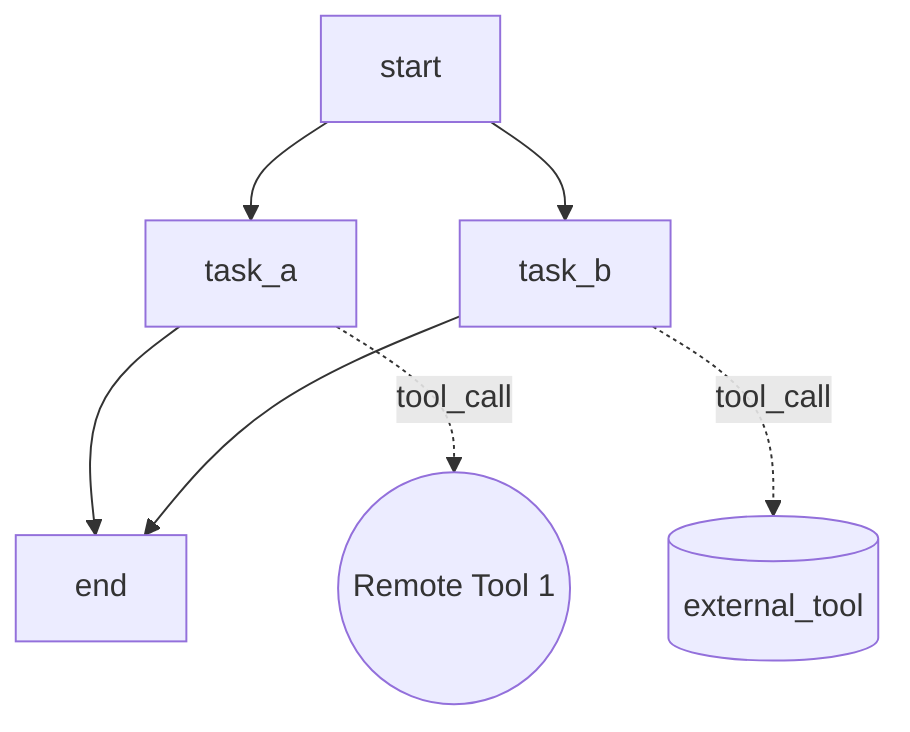

```mermaid
flowchart TD
    A0[end]
    A1[start]
    A2[task_a]
    A3[task_b]
    B0((Remote Tool 1))
    C0[(external_tool)]
    A1 --> A2
    A1 --> A3
    A2 --> A0
    A2 -.->|tool_call| B0
    A3 --> A0
    A3 -.->|tool_call| C0
```
Remote Tools:
- Remote Tool 1: http://localhost:8080
